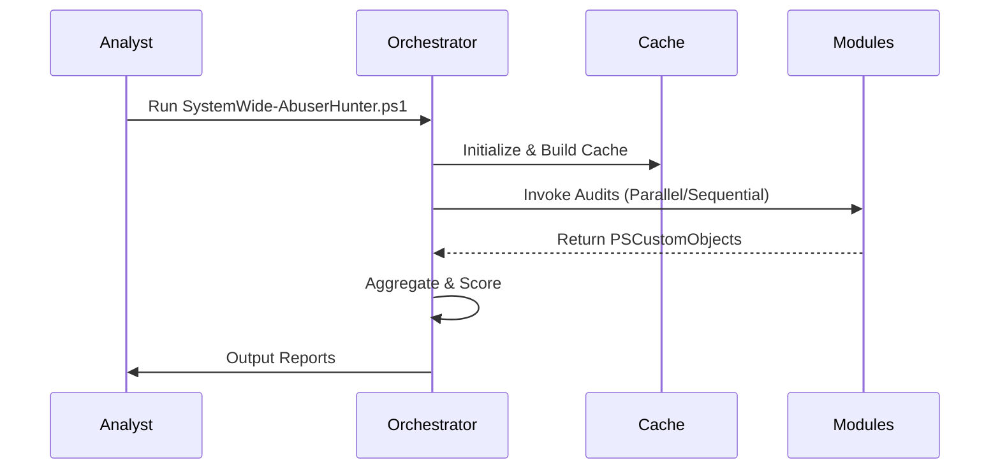

# API Guide (CLI Reference)

While SystemWide-AbuserHunter does not expose an HTTP REST API, it serves as a highly extensible PowerShell command-line application. 

## Main Entry Point
The primary execution vector is `SystemWide-AbuserHunter.ps1`.

### Usage
```powershell
.\SystemWide-AbuserHunter.ps1
```

### Outputs
The execution of the script generates timestamped folders in the `Reports/` directory containing:
1. `Audit.json` - Complete structured JSON suitable for Splunk/Elastic ingestion.
2. `Audit.html` - Interactive HTML dashboard.
3. `CSV/` - Tabular data for Excel or Pandas analysis.

### Standardized Execution Flow

