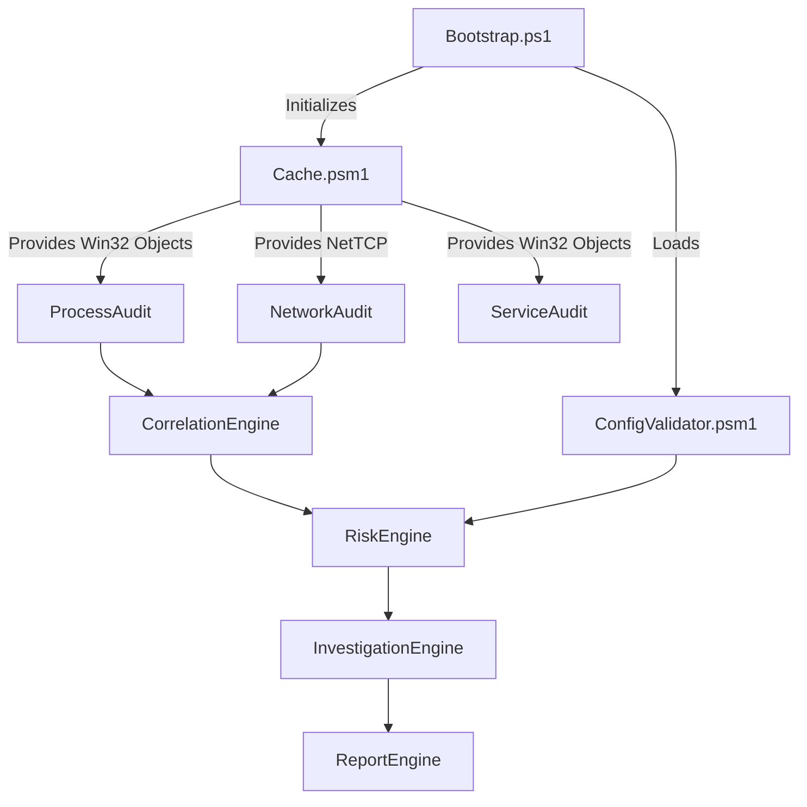

# Architecture Overview

SystemWide-AbuserHunter is built on a highly modular, decoupled architecture.

## Component Flow

## Design Decisions
1. **The Cache:** We chose `$script:AuditCache` to ensure WMI data is queried exactly once.
2. **Standard Result Contract:** All audit modules return `[PSCustomObject]@{ Data = $Array }`. This allows the orchestrator to blindly iterate and aggregate without worrying about module-specific data schemas.
3. **Graceful Degradation:** The orchestrator utilizes aggressive `try/catch` wrapping around each module invocation. If `RegistryAudit` crashes due to permissions, the script logs the failure but successfully generates reports for Processes and Networks.
