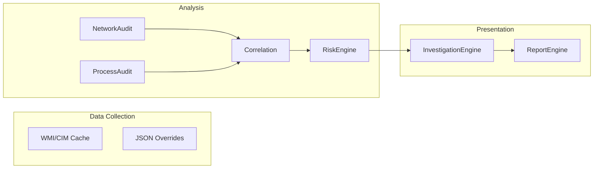

# System Design Document

## 1. Goals
- Provide immediate, actionable insight into anomalous system behaviors during an active incident.
- Centralize disparate forensic data (Processes, Networks, Registry, Services) into a correlated entity model.
- Operate securely in locked-down, air-gapped, or highly restricted Windows environments.

## 2. Assumptions & Constraints
- **PowerShell 5.1:** Chosen as the lowest common denominator across enterprise environments (Windows 10/Server 2016+).
- **Read-Only Constraint:** The tool must not alter system state, preserving forensic integrity (Locard's Exchange Principle).
- **No Third-Party Dependencies:** To guarantee execution on restricted systems, we cannot rely on NuGet, Chocolatey, or compiled `.exe` files like Sysinternals.

## 3. Design Philosophy
### The Centralized Cache Model
In early prototypes, querying WMI/CIM inside every audit loop caused exponential performance decay (O(N^2) time complexity). 
We engineered `Core/Cache.psm1` to execute a single, monolithic fetch of `Win32_Process` and `Win32_Service` at startup. All downstream modules query this in-memory hashtable, reducing execution time by ~85%.

### The Heuristic Risk Engine
Rather than relying on signature-based AV logic (which misses novel malware), the Risk Engine uses a points-based system mapped to MITRE ATT&CK concepts. A process accumulating points (e.g., Unsigned + AppData execution + Active Public Socket) surfaces to the top of the report automatically.

## 4. Module Boundaries

