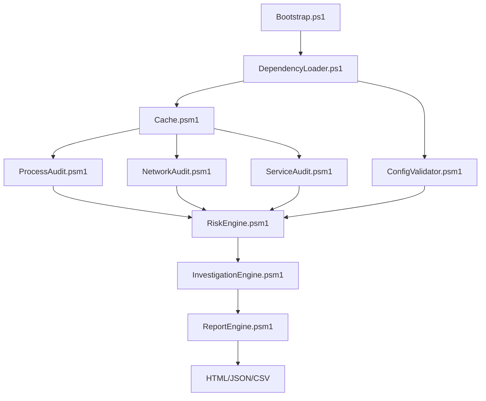

# 🛡️ SystemWide-AbuserHunter

Enterprise-grade, read-only Windows forensic auditing framework for rapid
DFIR triage.

[](https://microsoft.com/powershell)
[](https://www.microsoft.com/windows)
[](LICENSE)
[](CHANGELOG.md)
[](https://github.com/Sarvadnya07/Windows-Sentinel-Audit)

## 📖 Overview

SystemWide-AbuserHunter is a pure-PowerShell forensic orchestration tool
for zero-impact system auditing. It enables incident responders and
system administrators to enumerate, correlate, and score active
processes, network sockets, services, and persistence mechanisms without
third-party binaries or agents.

## 🎯 Why This Project Exists

During live incident response, analysts cannot always install heavy EDR
agents or compiled third-party tools. Compliance requirements, network
segmentation, or operational constraints may prevent that.

AbuserHunter operates within the native capabilities of PowerShell 5.1
and the Windows API, providing a self-contained, cached, read-only
telemetry engine.

## ✨ Key Features

- 🔍 **Read-Only Telemetry:** No registry modifications, process
  terminations, or system-state alterations.
- ⚡ **WMI/CIM Caching:** Queries the system once and shares objects
  across audit modules.
- 🔗 **Deep Correlation:** Links TCP sockets and persistence entries to
  running process IDs.
- ⚖️ **Heuristic Risk Engine:** Applies configurable JSON-based scoring.
- 📊 **Unified Reporting:** Generates HTML dashboards, JSON for SIEM
  ingestion, and CSV output for analyst workflows.

## 🏗 Architecture Overview

The `Core/` layer handles orchestration, caching, configuration,
and diagnostics. The `Modules/` layer implements audit,
correlation, risk, investigation, reporting, and export functionality.



## 🛠 Tech Stack

- **Language:** PowerShell 5.1+.
- **Data Exchange:** JSON, WMI/CIM, and Authenticode APIs.
- **Reporting:** Embedded CSS/HTML and CSV.
- **Dependencies:** None beyond native Windows capabilities.

## 📁 Folder Structure

```text
SystemWide-AbuserHunter/
├── SystemWide-AbuserHunter.ps1
├── Config/
├── Core/
├── Docs/
├── Modules/
├── Reports/
└── Tests/
```

## 🚀 Installation & Setup

1. Clone the repository onto the target machine or a secure USB device.
2. Run an elevated PowerShell session for maximum telemetry.
3. Review `Config/RiskWeights.json` and tune the heuristic weights.
4. Review generated output before using it in an incident workflow.

Standard-user execution is supported in degraded mode when privileged
telemetry is unavailable.

## 💻 Usage

Run the main orchestrator:

```powershell
.\SystemWide-AbuserHunter.ps1
```

A timestamped directory is created under `Reports/` with HTML,
JSON, and CSV outputs.

## 🔐 Security Measures

- **Strictly Read-Only:** Audit modules do not modify the target system.
- **Graceful Degradation:** Unprivileged telemetry failures are handled
  without turning the audit into a state-changing operation.
- **Dependency Free:** The framework relies on native Windows facilities.

Report-generation files are written only to the configured local output
directory.

## 📈 Scalability Considerations

The cache reduces repeated WMI/CIM queries, but very large process sets
can increase memory usage. Future work may introduce parallel runspaces.

## 🤝 Contributing

Read [CONTRIBUTING.md](CONTRIBUTING.md) and
[CODE_OF_CONDUCT.md](CODE_OF_CONDUCT.md) before opening a pull request.
New modules should follow the structured audit-result contract.

## 📄 License

This project is licensed under the [Apache 2.0 License](LICENSE).
