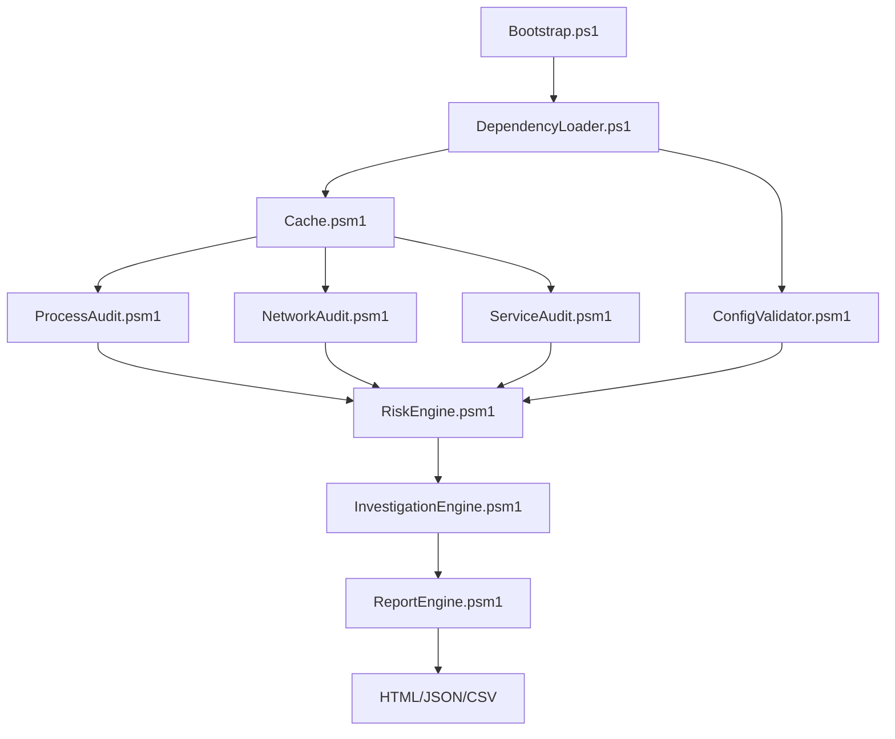

<div align="center">
  <h1>🛡️ SystemWide-AbuserHunter</h1>
  <p><b>Enterprise-grade, read-only Windows forensic auditing framework designed for immediate DFIR triage.</b></p>
  
  [](https://microsoft.com/powershell)
  []()
  [](LICENSE)
  []()
  []()
</div>

---

## 📖 Overview
SystemWide-AbuserHunter is a pure-PowerShell forensic orchestration tool designed for **zero-impact system auditing**. It enables Incident Responders and System Administrators to rapidly enumerate, correlate, and score active processes, network sockets, services, and persistence mechanisms without relying on third-party binaries or agents.

## 🎯 Why This Project Exists
During a live incident response, analysts cannot always install heavy EDR agents or rely on compiled third-party tools (like Sysinternals) due to strict compliance, network segmentation, or the risk of tipping off an adversary. AbuserHunter operates entirely within the native constraints of PowerShell 5.1 and the Windows API, providing a self-contained, heavily-cached, and fully read-only telemetry engine.

## ✨ Key Features
- 🔍 **Read-Only Telemetry:** Absolutely zero registry modifications, process terminations, or system state alterations.
- ⚡ **WMI/CIM Caching Layer:** Queries the system once and shares the objects across all audit modules, preventing CPU spikes.
- 🔗 **Deep Correlation:** Automatically links active TCP sockets and persistence entries to their running process IDs.
- ⚖️ **Heuristic Risk Engine:** Configurable JSON scoring (e.g., unsigned binaries running from `\AppData\` trigger immediate High-Risk alerts).
- 📊 **Unified Reporting:** Generates timestamped HTML dashboards, JSON blobs for SIEM ingestion, and CSVs for analyst slicing.

## 🏗 Architecture Overview
AbuserHunter utilizes a decoupled architecture where the `Core/` orchestrator handles caching and configuration, while stateless `Modules/` perform distinct audits.



## 🛠 Tech Stack
- **Language:** PowerShell 5.1+
- **Data Exchange:** JSON (Schemas), WMI/CIM, Authenticode APIs
- **Reporting:** Embedded CSS / HTML, CSV
- **Dependencies:** None. Strictly native Windows APIs.

## 📁 Folder Structure
```text
SystemWide-AbuserHunter/
├── SystemWide-AbuserHunter.ps1 # Entry orchestrator
├── Config/                     # JSON Risk Weights & Safelists
├── Core/                       # Caching, Logging, Config Validation
├── Docs/                       # Deep engineering & threat modeling docs
├── Modules/                    # Audit and Correlation Engines
├── Reports/                    # Output directory for HTML/JSON/CSV
└── Tests/                      # Validation and linting
```

## 🚀 Installation & Setup
1. Clone this repository directly onto the target machine or a secure USB.
2. Ensure you are running an elevated PowerShell session for maximum telemetry (Standard User will run in degraded mode).
3. Review `Config/RiskWeights.json` to tune the heuristic sensitivities for your environment.

## 💻 Usage Instructions
Simply invoke the main orchestrator script:
```powershell
.\SystemWide-AbuserHunter.ps1
```
Watch the real-time progress bar. Once completed, a new timestamped folder will appear in the `Reports/` directory containing your HTML dashboard and SIEM-ready JSON.

## 🔐 Security Measures
- **Strictly Read-Only:** Contains no state-mutating cmdlets (no `Set-Item`, `Stop-Process`, etc.).
- **Graceful Degradation:** Avoids noisy UAC prompts; if run as a standard user, it will securely skip privileged WMI classes rather than crashing.
- **Dependency Free:** Mitigates supply-chain attacks by relying solely on inbox Windows features.

## 📈 Scalability Considerations
While optimized via `Cache.psm1`, scanning machines with >2,000 active processes may cause memory bloat. Future iterations outline parallel Runspace pools in the [ROADMAP](ROADMAP.md).

## 🤝 Contributing Guidelines
We welcome PRs from the DFIR community! Please read our [CONTRIBUTING.md](CONTRIBUTING.md) and adhere to our [CODE_OF_CONDUCT.md](CODE_OF_CONDUCT.md). Ensure all new modules follow the `Get-StandardResult` contract.

## 📄 License
This project is licensed under the [Apache 2.0 License](LICENSE).
